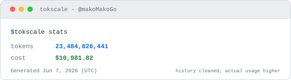

<h1>Fish Claude</h1>

**Fish's Coding Agent Configs**

个人配置镜像仓库，请按需选用，切勿盲目照搬乱套。

优秀的 Vibe Coder 是 "偷啃" 喂出来的。

本人真实用量，由 <a href="tools/tokscale-readme-svg/">tokscale-readme-svg</a> 生成

 

 

中文 | [English](README.en.md)

## 这是什么

它不是教程合集，也不是通用框架；而是我本人在用的 Vibe Coding 配置备份仓库，带有强烈的个人色彩。覆盖的 code agents 有（也是我日常使用的，排名分先后，按我个人喜好）：

- Pi + Claude Code
- Oh My Pi + Codex + Droid
- Kimi Code
- Warp
- OpenCode + Antigravity

## 先看这几个

- [codex-provider-history-migrator](tools/codex-provider-history-migrator/) —— 换 model provider 后找回 Codex 会话历史不再丢
- [agent-instructions](agent-instructions/) —— 模块化拼装你自己的全局规则
- [一份 AGENTS.md 喂所有 CLI](tips/shared-agents-md.md) —— 很少有人知道的小技巧

## 都有什么

| 内容 | 入口 | 用途 |
| --- | --- | --- |
| 规则模块 | [`agent-instructions/`](agent-instructions/) | 拼装全局 `AGENTS.md`   |
| Skills | [`skills/`](skills/) | 个人自用的 skills 合集  |
| 配置样例 | [`config-files/`](config-files/) | 一些个性化配置字段参考 |
| MCP | [`mcp/`](mcp/) | 还在用的 MCP server |
| Packs | [`packs/`](packs/) | 组合包和外部工具链 |
| Tools | [`tools/`](tools/) | 维护脚本和自定义 patch |
| 输出风格 | [`output-styles/`](output-styles/) | 一些有意思的风格预设 |
| Preset Cards | [`preset-cards/`](preset-cards/) | 有用的 Preset Card |
| System Prompts | [`system-prompts/`](system-prompts/) | 第三方系统提示词捕获，仅研究参考 |
| 主题 | [`themes/`](themes/) | Warp / Claude Code 等的主题 |
| Sub-agents | [`sub-agents/`](sub-agents/) | subagent && multi-agent 实践 |
| 命令 | [`slash-commands/`](slash-commands/) | Slash command 模板 |
| Tips | [`tips/`](tips/) | 你不知道的实用小技巧 |
| GitHub Apps | [`github-apps/`](github-apps/) | 我挂的 GitHub App / Bot（review、依赖、性能） |

## 食用指南

看完哪些感兴趣就 copy paste 用呗。都是可插拔的，有联动的我也基本都标注了。我的不一定适合你，建议你感兴趣的就测试一下，不好用就不用，好用就留着，也可以自己去魔改。总之，最后你肯定是用 pi 自己魔改。

配合 [Mako's Blog](https://makomakogo.github.io/) 食用更佳。

## 贡献

如有问题，欢迎提交 Issue 讨论交流。纯个人项目，不收 PR 。

## 许可证

本仓库原创内容以 MIT 发布。`system-prompts/` 收录的第三方系统提示词与 `preset-cards/` 等处标注来源的第三方内容，版权归原作者或原公司所有，仅作研究参考，不在 MIT 授权范围内。
